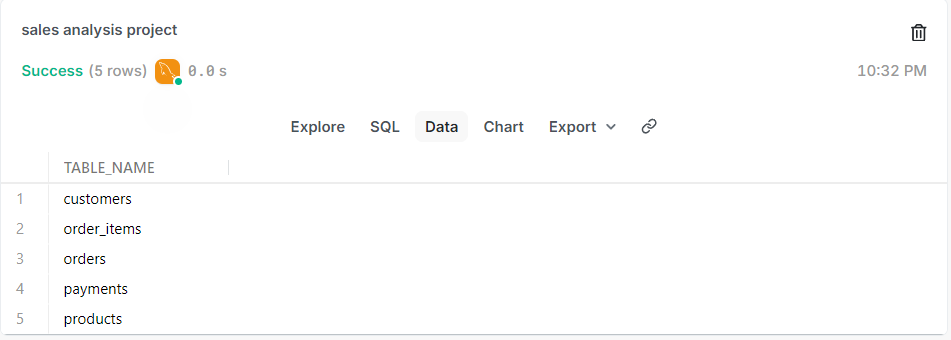
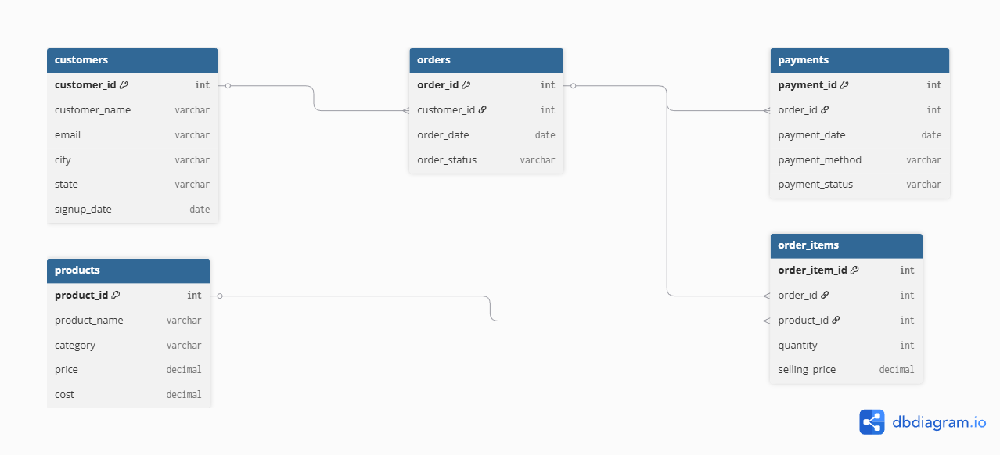
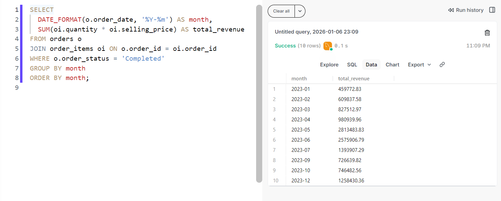

# Sales Analysis using SQL (MySQL)
End-to-end Sales Analysis project using MySQL with real-world schema, foreign keys, and business insights.

## 📌 Project Overview
This project is an end-to-end Sales Analysis system built using MySQL.
It simulates a real-world business database and focuses on extracting meaningful business insights using SQL.

The project demonstrates database design, data integrity using foreign keys, and analytical SQL queries used in real Data Analyst roles.

---

## 🛠️ Tools & Technologies
- MySQL
- PopSQL
- GitHub

---

## 🗂️ Database Design
The database is designed using relational modeling and consists of five tables:

- customers  
- products  
- orders  
- order_items  
- payments  

### 📋 Tables Overview
The following screenshot shows all tables created for this project:

### 🔗 Entity Relationship Diagram (ERD)
The ER diagram below shows the relationships between tables using primary and foreign keys:

---

## 📊 Key Analysis Performed
- Monthly revenue trend analysis
- Total revenue calculation
- Top-selling and most profitable products
- Repeat customer identification
- Revenue by product category
- Payment method analysis

---

## 📈 Sample Analysis Output
Below is an example of a monthly revenue analysis query and its output:

---

## 📂 Project Structure
Sales-analysis-sql/
│
├── schema/
│   └── create_tables.sql
│       # Contains all CREATE TABLE statements
│       # Defines primary keys, foreign keys, and relationships
│
├── data/
│   └── insert_data.sql
│       # Contains INSERT statements
│       # Populates tables with realistic sales data
│
├── analysis/
│   └── sales_queries.sql
│       # Contains business-focused SQL queries
│       # Revenue analysis, joins, aggregations, insights
│
├── screenshots/
│   ├── tables.png
│   │   # Screenshot showing all database tables
│   ├── er_diagram.png
│   │   # ER diagram representing table relationships
│   └── sample_output.png
│       # Screenshot of SQL query and its output
│
└── README.md
    # Project documentation and explanation

---

## 📜 SQL Files
The complete SQL code for this project is organized as follows:

- **Table Creation (DDL)**  
  `schema/create_tables.sql`

- **Data Insertion (DML)**  
  `data/insert_data.sql`

- **Analysis Queries**  
  `analysis/sales_queries.sql`

---

## ✅ Key Learnings
- Designed relational databases with proper normalization
- Implemented foreign key constraints to maintain data integrity
- Generated realistic bulk sales data
- Wrote complex SQL queries using JOINs, GROUP BY, and aggregations
- Converted raw sales data into business insights

---

## 🚀 Conclusion
This project demonstrates practical SQL skills required for Data Analyst and Backend roles.
It focuses on real-world database design and analytical problem-solving rather than basic SQL syntax.

